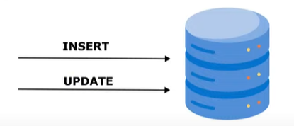
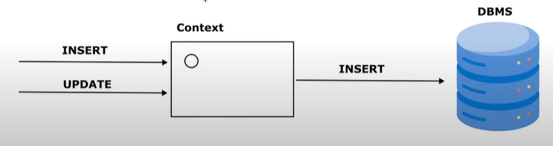

**JPA** 
(Jakarta Persistence API) temel anlamda uygulamamızda persistence katmanı için bir temel yoldur. Java programlama dilinde Java sınıfları ile ilişkisel veritabanı tablolarını ilişkilendirmek için ortaya çıkmış bir standarttır

**ORM**: 
Object Relational Mapping. Database de bir entity’miz var. Kendi programımızdaki Obje’ler ile veri tabanındaki entity’ler arasında bir ilişki dizayn etmedir. Bu objeler veri tabanındaki entity’leri gösterir.

**Hibernate**: 
JPA spesifikasyondur. Hibernate ise bu spesifikasyonun implementasyonudur. Bu JPA’daki standartları yerine getirir.

**JDBC**: 
Java Database Connection.

**SQL**: 
Structured Query Language

JDBC kullandığımızda bir INSERT veya UPDATE komutu veridiğimizde doğrudan veri tabanında değişiklik yapmış oluruz.

JPA ise JDBC’ye göre daha farklı çalışır. INSERT veya UPDATE komutu gönderdiğimizi varsayalım. Bu Entity’miz önce bir Context’te oluşturulur.
Context'lerin içerisinde Entity'lerin instance'ları bulunur. Framework instance'ları önce context içerisinde tutar.
Örneğin bir instance ekledik daha sonra aynı instance üzerinde bir Update işlemi yaptık. Bu durumda veri tabanına yalnızca bir query gönderilir.
Çünkü instance context içerisinde iken tüm işlemler yapılır. Context veri tabanına yansıtıldığında veri tabanına query gönderilir.

